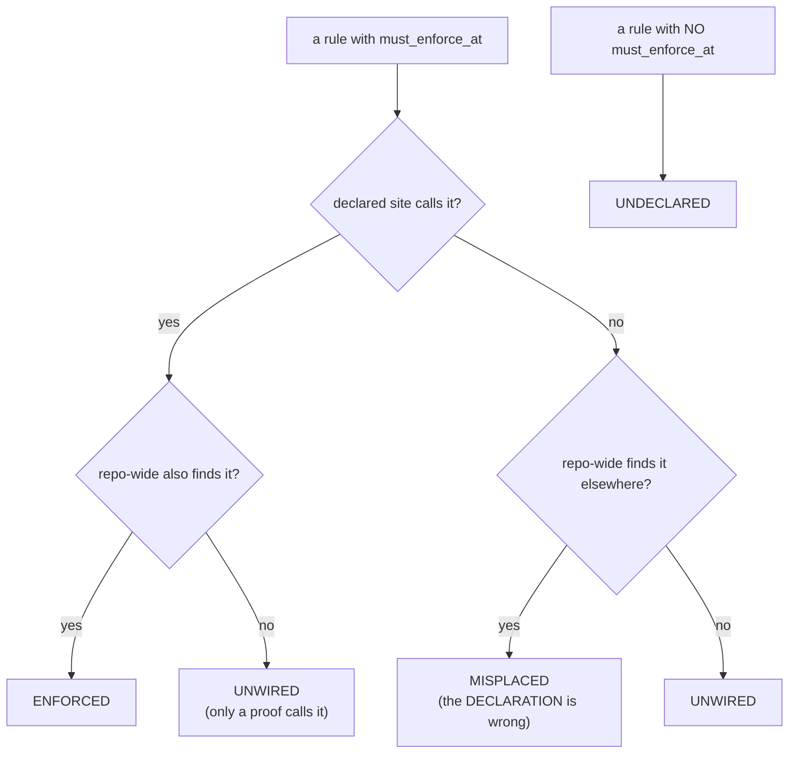

# Enforcement Audit (discover a rule that is stated but not enforced)

**Goal:** 一條規則聲明佢**應該喺邊度被 call**；audit 檢查嗰啲 write site **係咪真係 call 佢**。

Full skill: `skills/1_core/enforcement_audit/enforcement_audit.skill.md`
Rule module: `enforcement_audit.py` · Proof: `_proof_enforcement_audit.py`
Contract: `SKILL.ENFORCEMENT.AUDIT` · Probe token: `EA.` · Registered by `skill_registrar.py`

## When to use

- 一條規則／gate 函數**存在**，但**生產 write site 冇 call 佢**（只有 proof／test 叫佢）
- 你寫緊「the rule is written down」、「the gate exists」、「the proof covers it」
- 一條規則喺**一個位** enforce 咗，但**兄弟位**冇（例如 `prune` 只做咗 1 個 child table）

## 為何呢個 skill 存在

MEASURED 2026-09-29：一個 session 內**兩次**缺陷都係**人察覺**，唔係機制：

- `measurement_scope.assert_scoped` —— write-site gate，**0 個生產 caller**
- `prune` 原則 —— 只喺 **2 個 child table 中嘅 1 個**落地

用戶原話：

> 「一個規則／機制函數**存在**，但佢嘅**生產 write site 冇實際 call 佢**（只有 proof／test 叫佢）→ 就係「stated but not enforced」。」
> 「呢個特徵係**機器可檢測**嘅，唔使靠人望。」

## 兩個獨立 reader（QC-10 — `SAME_READER` 規則）

只讀規則自己聲明嘅 audit，會同聲明**共用同一個盲點**：聲明寫錯 + audit 讀錯 = **兩個都錯但一致**。所以 audit 跑**兩個 reader，method 同 source 都唔同**：

| reader | 讀乜 |
|---|---|
| **A — declared-site scan** | 讀 `must_enforce_at`，檢查嗰啲檔有冇 call |
| **B — repo-wide scan** | **完全唔讀聲明**，掃成個 code tree 搵 call |

| status | 意思 |
|---|---|
| `ENFORCED` | 聲明嘅 site 有 call **且** repo-wide 搵到 |
| `UNWIRED` | 聲明嘅 site 冇 call **且** repo-wide 搵唔到 |
| `MISPLACED` | 聲明嘅 site 冇 call **但** repo-wide 喺第度搵到 → **聲明錯** |
| `UNDECLARED` | 冇 `must_enforce_at` → 冇人講過佢應該喺邊度落地 |



## 硬規則

1. **caller 檢查係 `ast` call，唔係 substring。** comment／docstring 提到唔算 call。
2. **唔准只讀規則自己嘅聲明就當核對。** 一定要有 reader B 掃 code tree。
3. **發現係 gate，唔係 log（QC-09）。** finding 入 `enforcement_finding`（`OPEN`/`CLOSED`），**有 OPEN 就 exit 非零** → sweep FAIL → 交貨唔可以當完成。
4. **唔准聲稱捉到所有缺陷。** 佢只捉「**聲明咗要 enforce 但冇 call**」；**連規則都冇立**嘅隱藏缺陷，佢捉唔到。
5. **唔准自動修。** audit 要先證明**捉得到**，先准佢**修**。

## 用法

```python
import enforcement_audit as ea

conn = ea.sqlite3.connect("agent.db")
rep = ea.audit(conn)                 # two readers, one verdict per rule
rep["checked"]                       # how many rules were checked
rep["findings"]                      # UNWIRED / MISPLACED / UNDECLARED
ea.record_findings(conn, rep)        # TRACK them (OPEN/CLOSED)
ea.open_findings(conn)               # what must be followed up
```

```text
python enforcement_audit.py            # exit non-zero while any finding is OPEN
python enforcement_audit.py --report   # read-only view, always exit 0
```

## 紅旗

- 「呢條規則有 proof 就當 enforce 咗」→ proof 叫佢唔算生產 enforce
- 「我聲明咗喺 X 度 call」→ 有冇真係 call？用 `ast` 睇，唔係睇字
- 「audit 話冇事」→ 有冇正控制證明佢識 fire？
- 「報咗個 finding 喇」→ 有冇 `OPEN` row？有冇 exit 非零？
