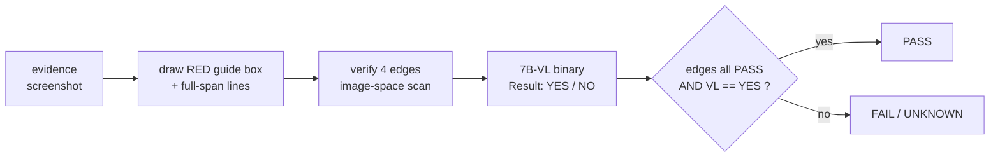

# Evidence Classify (PASS/FAIL on a labelled region)

**Goal:** let a worker classify their work **by evidence** — easily, and without
being able to fake it.

Full skill: `skills/5_qa/evidence_classify/evidence_classify.skill.md`

## When to use

- A worker must classify their own output from a screenshot
- You need PASS/FAIL that a labelled region really contains what it claims
- You are fixing a **false success**: a check reports "confirmed" but nothing
  actually changed (geometry was never proven)
- You are about to trust a vision-detected coordinate, box, or region
- Any UI automation where a wrong box would silently click the wrong thing

## The method in one picture



The red box does **two** jobs: it lets a human see at a glance whether the box is
right, and it gives the VL model a reference frame (“the text inside the RED
BOX”) that sharply cuts hallucination.

## Hard rules

1. **PASS needs both.** Edges all-PASS **and** VL `YES`. Neither alone is enough.
2. **An uncertain result is never a pass.** Not-found edge, flat window, collapsed
   rect, non-yes/no answer, vision error, missing file → `FAIL`/`UNKNOWN`.
3. **Show the overlay to a human.** A verdict without a viewable artefact is not
   evidence.
4. **Fix the prompt template.** A reworded question is a different experiment and
   invalidates earlier results.
5. **Convert coordinates before cropping.** Screenshots may differ in size from
   the real screen (OpenClaw `maxWidth=1600` → 1600x900). Read
   `Image.open(p).size`; never hard-code a scale factor.
6. **Draw the label BEFORE the lines.** Z-order matters — a label drawn last
   hides the very line you need to inspect.
7. **The edge scan window scales with the target.** `scan_radius` =
   `max(2, min(24, span // 3))` per axis. Measured on a 30×30 icon: a fixed ±24
   window made all four edges resolve to the SAME spot (X2 `delta=17` on a
   correct rect). A small button is **not** "borderless" — its edges are strong
   (step 59–64); the window was simply too wide.
8. **On a dense menu, read the box INTERIOR, not the whole image.** Asked on a
   full screenshot holding 5 near-identical rows 30–60px apart, the 7B-VL named
   the row BELOW while the box was provably correct. A tight crop leaves nothing
   to confuse it with.
9. **Locate a region by CONTENT, never by list index.** The detected band count
   varied (9 → 10), so `bands[1]` moved rows; bands 1–2 were terminal text, not
   the menu at all. Transcribe each candidate and match the text; skip unmatched
   bands rather than guessing.

## Usage

```python
import evidence_classify as ec

res = ec.classify_with_overlay(
    "shot.png", x1, y1, x2, y2, "Default permissions", "overlay.png",
)
# res["verdict"]        PASS | FAIL | UNKNOWN
# res["edges_all_pass"] bool
# res["edges"]          [{edge, candidate, detected, delta, verdict}]
# res["vl"]             {verdict, answer, reason, parser, model}
# res["overlay_path"]   the artefact to show a human
```

```
python evidence_classify.py IMG LABEL                  # VL verdict only
python evidence_classify.py IMG LABEL X1 Y1 X2 Y2 OUT  # full pipeline
```

| Edge | Axis | Detects |
|---|---|---|
| X1 | vertical | region left boundary |
| X2 | vertical | region right boundary |
| Y1 | horizontal | region top boundary |
| Y2 | horizontal | region bottom boundary |

`delta = |detected - candidate|` → `PASS <= 3px`, `WARN <= 8px`, else `FAIL`.
The "nudge ±5" search runs in **image space** as a 1D scan over ±24px — no real
mouse movement, so it is fast, repeatable, and cannot disturb other windows.

## Local model only

Ollama `qwen2.5vl:7b` on `127.0.0.1:18803` via
`vision_analyze.analyze_evidence(parse_mode="result_yes_no")`.
Zero token cost. No new dependency.

## Verified 2026-09-19

| Case | Result |
|---|---|
| Correct rect | all 4 edges PASS |
| Rect off by 40px | WARN + no-edge FAIL, `all_pass=False` |
| Blank region | all 4 FAIL |
| Full-span lines | X1 200/200 px, Y1 400/400 px |
| VL, correct label | PASS / YES, quotes the box text |
| VL, wrong label | FAIL / NO, quotes the actual text |
| VL, no red box present | FAIL / NO — the box is load-bearing |