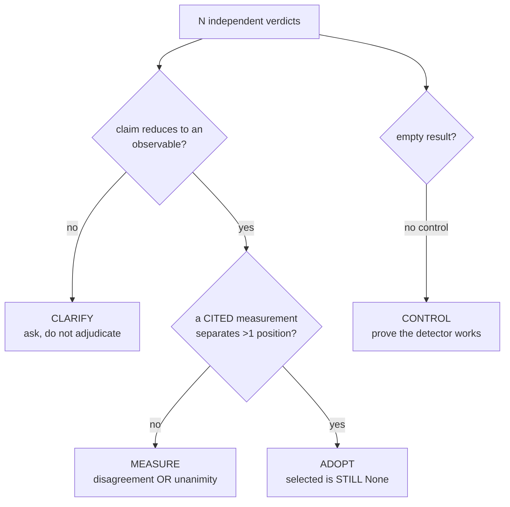

# Independent Review (disagreement triggers measurement, not a vote)

**Goal:** use multiple independent workers as a **measurement trigger** — and
never as a vote.

Full skill: `skills/1_core/independent_review/independent_review.skill.md`
Rule module: `independent_review.py` (pure functions)

## When to use

- Two or more workers / models / reviewers answered the **same** question
- You are about to resolve a disagreement by **majority, average, or "the most
  confident one"**
- You are about to use **"they all agree"** as a reason
- You received an **empty result** and are about to call it "nothing found"
- You are about to conclude something from a **heuristic rule**

## The method in one picture



`selected` is **always `None`**. Adopting means "a measurement closed it", never
"a worker won".

## Hard rules

1. **Agreement is not evidence.** N workers agreeing is N shared assumptions. If
   all three read the same wrong document, the ratio is 1.0 and the answer is
   wrong with full confidence.
2. **A disagreement triggers a measurement, not a vote.** Never average, never
   take the majority, never pick the most confident, never pick a winner. A
   winner is exactly what this skill forbids.
3. **The minority is returned, not discarded.** One dissenting worker may be the
   only correct one — that is the entire reason to look at the disagreement.
4. **A claim must reduce to an observable.** `{"modules": 7}` is checkable —
   it names a count a third party can go and count. `"it is too slow"` is not,
   and cannot be adjudicated, only agreed with.
5. **A measurement must be CITED and must separate more than one position.** An
   uncited measurement is an opinion. A measurement that addresses one position
   can only confirm, not discriminate.
6. **An empty result needs a positive control.** A broken detector and an honest
   empty result have the *same* output. Measured: three consecutive detectors
   in one session each returned `{}` and each time it was reported as success.
7. **Measure a heuristic rule in BOTH directions.** A rule that matches
   everything and a rule that matches nothing are equally useless and equally
   confident. One number cannot tell you which failure you have.

## Usage

```python
import independent_review as ir

res = ir.adjudicate(verdicts, measurement=None)
# res["selected"]       always None — never a worker's claim
# res["next_action"]    ADOPT | MEASURE | CLARIFY | CONTROL | REFUSE
# res["positions"]      how many distinct positions were held
# res["agreement_ratio"] reported, NEVER acted on
# res["disagreeing"]    the minority positions, kept

ir.assert_may_adopt(verdicts, measurement=..., cite_ref=...)
# raises UndiscriminatedDisagreement instead of permitting a vote

ir.assert_positive_control({"found": [], "positive_control": [...]})
# raises NoPositiveControl for an empty result with no control

ir.measure_rule(lambda p: "center" in p, routes)
# {matched, match_rate, matches_nothing, matches_everything}
```

```python
# The real case from this session
verdicts = [{"worker": "DeepSeek", "claim": {"modules": 7}},
            {"worker": "豆包",      "claim": {"modules": 16}},
            {"worker": "Gemini",   "claim": {"modules": 8}}]
ir.adjudicate(verdicts)["next_action"]   # -> "measure"
ir.adjudicate(verdicts)["selected"]      # -> None
```

## Real measured record

| Event | Why it was wrong |
|---|---|
| 3 workers answered **7 / 16 / 8** modules | all three judgement; none built on a measurement |
| my token-overlap rule | 25 cross-module routes, **20 false positives** (`center` matched `task_center`) |
| my strict substring rule | 5. Two rules, two answers, both confident. |
| detector v1 / v2 / v3 | each returned `{}` and each was reported as success |
| `len(Counter(x)) >= 1` | true for any non-empty list — a condition that cannot fail |

**All five are the same disease: a rule written down but never enforced at the
point of action.**

## The failure class this guards

A detector whose honest answer and broken answer are **both the empty
collection**. Success and failure become the same observable, so the broken
state reads as "no problem found" — worse than no detector, because no detector
at least leaves the question open.