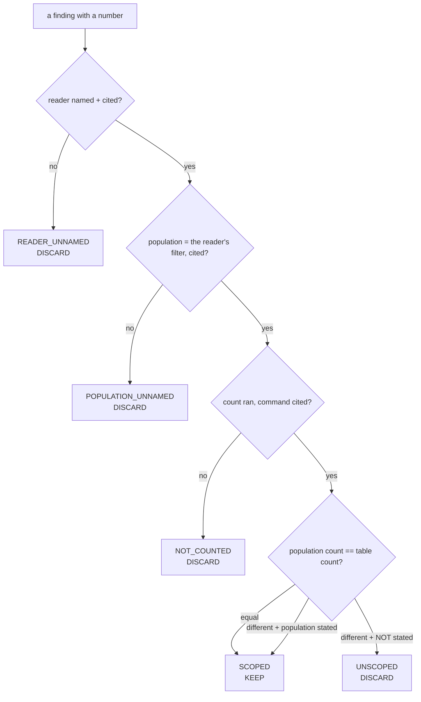

# Measurement Scope (name the population before you count it)

**Goal:** 一個 finding 嘅數字，必須係 **reader 回傳嘅 population** 嘅數字。

Full skill: `skills/1_core/measurement_scope/measurement_scope.skill.md`
Rule module: `measurement_scope.py` (pure functions) · Proof: `_proof_measurement_scope.py`
Contract: `SKILL.MS` · Probe token: `MS.` · Registered by `skill_registrar.py`

## When to use

- 你準備為一個 finding **數任何嘢**：row count、file count、route count、test count
- 你寫緊「the list is X% noise」、「there are N of them」、「most of them are Y」
- 你**已經有引用**，問題**已經完全陳述**，但你唔肯定個數字係講邊個集合
- 你發現自己講「the table has N rows」但讀者睇嘅係一個 **filter 過嘅清單**

## 為何現有兩個 skill 捉唔到

| skill | 佢捉乜 | 佢捉唔到乜 |
|---|---|---|
| `citation-discipline` | 冇引用嘅 finding | **一個引用可以係「正確地數錯 population」** |
| `problem-statement` | 冇 target/expected/actual/observable | **四樣齊全，但講錯集合** |

**所以一個 finding 可以「完全有引用」+「完全有陳述」，仍然係錯。** 呢個 skill 補嗰一步。

## 四步，每步一個 STATUS

| # | 步驟 | status | 閘（可以 FAIL） |
|---|---|---|---|
| 1 | **NAME THE READER** | `READER_NAMED` / `READER_UNNAMED` | reader 係 function / query / endpoint，要 cite `path:line` |
| 2 | **NAME THE POPULATION** | `POPULATION_NAMED` / `POPULATION_UNNAMED` | population 係 **reader 自己嘅 filter**，要 cite |
| 3 | **COUNT THE POPULATION** | `COUNTED` / `NOT_COUNTED` | count 要跑 reader 嘅 filter，要 cite 指令 |
| 4 | **COMPARE TO THE TABLE** | `SCOPED` / `UNSCOPED` | **兩個 count 都要有**；唔同 → finding 必須講明 population |



## 硬規則

1. **表嘅行數唔係清單嘅行數。** `COUNT(*) FROM t` 同 `COUNT(*) FROM t WHERE <reader's filter>` 係兩個唔同嘅數。讀者睇嘅係後者。
2. **第 4 步一定要跑，即使兩個數相等。** 一個只在「數唔同」時才跑嘅檢查，永遠唔會跑容易嘅情況 — 而永遠唔跑嘅檢查**唔可能 FAIL**。（同 `independent-review` 嘅 `len(Counter(x)) >= 1` 同一種病。）
3. **`UNSCOPED` 係丟棄，唔係降級。** 冇「低信心」標籤。降級會令錯 population 嘅 finding 換個名繼續存在。
4. **閘要喺寫入點叫。** `assert_scoped()` 喺 finding 寫落 DB / 報告之前叫。一個冇人喺寫入點叫嘅判斷式，等於冇。
5. **一個 SCOPED finding 仍然要引用。** 呢個 skill 加一步，唔係取代 `citation-discipline`。

## 用法

```python
import measurement_scope as ms

scope = ms.scope_finding(
    reader="working_environment.all_paths()",
    reader_cite="working_environment.py — all_paths()",
    population="WHERE is_active=1",
    population_cite="working_environment.py — all_paths() filter",
    population_count=4,
    table_count=75,
    count_command="SELECT COUNT(*) FROM working_environment WHERE is_active=1",
    population_stated=True,
)
scope["status"]   # -> "SCOPED"
scope["keep"]     # -> True

ms.assert_scoped(scope, cite_ref="working_environment.py:all_paths")
# raises UnscopedFinding when the status is not SCOPED

kept, dropped = ms.partition(findings)   # dropped is GONE, not relabelled
```

## 真實量度記錄（2026-09-27）

| 事件 | 為何係錯 |
|---|---|
| 我報「workspace 清單 89% 係 proof 殘留」 | 我數咗 `COUNT(*) FROM working_environment` = **75**（**表**） |
| 清單實際回傳 | `WHERE is_active=1` = **4**，其中 `kind LIKE 'PROOF%'` = **0** |
| 我嘅引用 | **真確** — 個 count 真係跑到，只係數錯集合 |
| 我嘅問題陳述 | **四要素齊全** — 但講錯集合 |
| `residue_cleanup.py --census` | `0 still is_active=1; soft-delete, never DELETE` |

**同一個 finding、兩個 population、兩個判決。** 呢個就係呢個 skill 存在嘅理由。

## 紅旗

- 「the table has N rows」→ 讀者睇嘅係表，定係清單？
- 「我數過」→ 數邊個 filter？
- 「個數好明顯」→ 明顯唔係 population
- 「先報，之後再核對」→ 之後永遠唔會核對
- 「差唔多啦」→ 75 同 4 差唔多？
