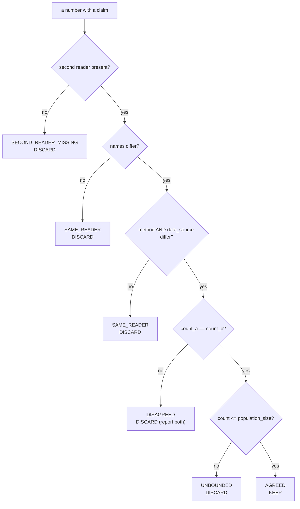

# measurement_cross_check — a number must be REPRODUCED by an INDEPENDENT reader

**Goal:** 一個 finding 嘅數字，必須由**第二個獨立 reader** 重現，並且**唔可以超出**佢所數嘅 population 大小。

Rule module: `measurement_cross_check.py` (pure functions) · Proof: `_proof_measurement_cross_check.py`
Contract: `SKILL.MEASUREMENT.CROSS.CHECK` · Probe token: `XC.` · Registered by `skill_registrar.py`

## 為何呢個 skill 存在

MEASURED 2026-09-29：agent 報「1516 條 uncovered 路徑」，**錯咗 22 倍**（真實係 776 結構性、532 唔係產品碼、69 真碼）。捉到佢嘅，係 agent 自己問「個數應該係幾多」——**人肉判斷**。

用戶原話：

> 「份報告靠『問個數應該係幾多』嚟捉量度錯 —— 呢個係人肉判斷，唔係系統化」
> 「依賴人（或 agent）自覺，唔係依賴機制」

呢個同 plan gate 嘅 fail-open 係**同一個病**。呢個 skill 就係取代嗰句人肉問題嘅**機制**。

## 為何 `measurement_scope` 補唔到

| skill | 佢捉乜 | 佢捉唔到乜 |
|---|---|---|
| `measurement_scope` | 個數有冇**講明 population** | 個數可否由**第二個 reader 重現**；個數有冇**超出 population 大小** |

1516 個錯，兩樣都過：population 有講、引用係真、個數就係錯。

## 兩個機制

**機制 A — CROSS-READER**：聲明**兩個 reader**，每個係 `{name, method, data_source}`。三者**任一相同**都唔算獨立。

**機制 B — BOUND**：個數必須 **≤ 獨立量度到嘅 population 大小**。1584 > 329 就自動拒，**唔使任何人問「應該係幾多」**。

## 五步，每步一個 STATUS

| # | 步驟 | status | 閘（可以 FAIL） |
|---|---|---|---|
| 1 | **SECOND READER PRESENT** | `SECOND_READER_MISSING` | 冇第二 reader → 一個 reader 唔算核對 |
| 2 | **READERS ARE DISTINCT** | `SAME_READER` | 兩個 reader 同名 → 自己對自己 |
| 3 | **READERS ARE INDEPENDENT IN SOURCE** | `SAME_READER` | 共用 `method` 或 `data_source` → 同一個 bug 可以一致 |
| 4 | **THE TWO NUMBERS AGREE** | `DISAGREED` | 兩個數唔同 → **兩個都要報** |
| 5 | **THE NUMBER FITS ITS POPULATION** | `UNBOUNDED` | 個數 > population 大小 → 不可能 |



## 硬規則

1. **同一個 reader 用兩次唔算核對。** 1516 就係同一個 parser 跑兩次（12，然後 1584）。
2. **兩個 reader 必須喺 `method` 同 `data_source` 都唔同，唔止名唔同。** 兩個唔同名嘅 wrapper 包住**同一個 parser**，可以**兩個都錯但一致**——報 `AGREED` 比冇第二 reader **更危險**，因為佢聲稱「驗證咗」。**判定係 `SAME_READER`**（同一個 reader 用兩次係同一種病），detail 會講明係名、method 定 source 出事。
3. **冇宣告 `method`／`data_source` 一律拒。** 宣告唔到就證明唔到獨立，安全方向係拒。
3. **個數唔可以超出 population 大小。** 呢個係用戶嗰句「應該係幾多」變成可跑嘅分母比較。
4. **第 5 步一定要跑，即使個數細。** 一個只在「數大」時才跑嘅檢查，永遠唔會跑容易嘅情況——而永遠唔跑嘅檢查**唔可能 FAIL**。
5. **非 `AGREED` 係丟棄，唔係降級。** 冇「低信心」標籤。
6. **閘要喺寫入點叫。** `assert_cross_checked()` 喺 finding 寫落 DB／報告之前叫；`skill_factor.record_proof` 對 `requires_cross_check=1` 嘅 factor 會**拒絕**冇 `AGREED` row 嘅 proof。

## 用法

```python
import measurement_cross_check as xc

scope = xc.cross_check(
    reader_a={"name": "plan_gate.plan_allowlist",
              "method": "regex over the plan's allowlist section",
              "data_source": "qc_evidence/plan_*.md"},
    reader_b={"name": "entity_backfill.covered_by",
              "method": "SQL over code_location_registry",
              "data_source": "agent.db:code_location_registry"},
    count_a=69, count_b=69,
    population_size=329,
    population_cite="ls qc_evidence/plan_*.md | wc -l",
    count_command="ls qc_evidence/plan_*.md | wc -l",
)
scope["status"]   # -> "AGREED"
scope["keep"]     # -> True

xc.assert_cross_checked(scope, cite_ref="measurement_cross_check.py:1")
# raises UncrossCheckedFinding when the status is not AGREED

kept, dropped = xc.partition(findings)   # dropped is GONE, not relabelled
```

## 真實量度記錄（2026-09-29）

| 事件 | 為何係錯 |
|---|---|
| 我報「1516 條 allowlist-only 路徑 = 工作」 | 個數係一個**總數**，唔係一個問題 |
| 真實 split | 776 結構性、532 唔係產品碼、**69 真碼** |
| 我嘅引用 | **真確** — 個 count 真係跑到 |
| 我嘅 population | **有講** — 但個數仍然錯 |
| 捉到佢嘅 | **人問「應該係幾多」** — 唔係機制 |
| 機制 B 會點做 | 1584 > 329 → `UNBOUNDED`，**唔使人問** |

## 紅旗

- 「兩個 reader 都話係咁」→ 佢哋係咪**同一個 parser**？
- 「我交叉核對過」→ 兩個 reader 嘅 `method` 同 `data_source` 係乜？
- 「個數好明顯」→ 明顯唔係 population 大小
- 「先報，之後再核對」→ 之後永遠唔會核對
- 「差唔多啦」→ 1584 同 329 差唔多？
