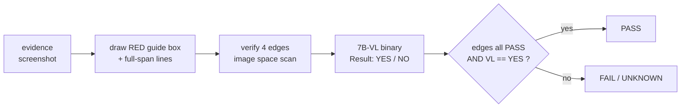

# Skill: evidence_classify

**Goal:** let a worker classify their own work **by evidence** — easily, and
without being able to fake it.

Package path: `skills/5_qa/evidence_classify/`

## The problem this solves

A worker can produce a screenshot. Turning that screenshot into a trustworthy
PASS/FAIL is the hard part. Two failure modes:

1. **Ambiguous evidence.** "Does this crop show X?" invites a VL model to
   hallucinate, because a bare crop has no reference frame.
2. **Unproven geometry.** Storing `X1,Y1,X2,Y2` does not mean the box actually
   sits on the target. A mis-measured box can still be "confirmed".

Result: *recorded success, but nothing actually changed.*

## The method



### 1. Red guide box — one artefact, two jobs

| Audience | What the box gives them |
|---|---|
| Human | Full-span lines show whether the box **really cuts** the row boundary |
| VL model | A reference frame — "text inside the RED BOX" beats "this crop" |

**Full-height / full-width lines are the point.** A plain rectangle only shows
the box. A line running the whole image lets you follow it and see whether it
lands on the boundary or is 40px off.

```python
import evidence_overlay as eo
edges = eo.verify_edges(img, x1, y1, x2, y2)
ov = eo.draw_guide_box(img, x1, y1, x2, y2, label="Default permissions", edges=edges)
ov.save("overlay.png")
```

### 2. Four independent edge verdicts

Each edge is checked on its own:

| Edge | Axis | Detects |
|---|---|---|
| X1 | vertical | text left boundary |
| X2 | vertical | text right boundary |
| Y1 | horizontal | row top boundary |
| Y2 | horizontal | row bottom boundary |

`delta = |detected - candidate|` → `PASS <= 3px`, `WARN <= 8px`, else `FAIL`.

The "nudge right 5 / left 5" search runs **in image space** as a 1D scan over
±`scan_radius`. No real mouse movement — fast, repeatable, cannot disturb other
windows.

#### 2a. ⚠️ The scan window MUST scale with the target size

`scan_radius` defaults to **`max(2, min(24, span // 3))`**, computed **per axis**
from the rect's own width/height. A fixed ±24px window presumes the target is at
least ~48px across, and on anything smaller it produces an unavoidable FAIL.

Measured on a 30×30 icon (rect correctly placed on the glyph ink):

| edge | candidate | detected with ±24 | detected with span//3 |
|---|---|---|---|
| X1 | 6 | **7** | 5 |
| X2 | 24 | **7** ❌ | 23 ✅ |
| Y1 | 6 | **5** | 5 |
| Y2 | 24 | **5** ❌ | 23 ✅ |

With ±24 the window contained the glyph's LEFT edge whichever edge was being
tested, so all four resolved to the same place; X2 reported `delta=17` and Y2
`delta=19` against a rect that was right. Capping to `span//3` makes each edge
find its **own** boundary.

`EdgeResult.note` now carries `radius=N` so the window actually used is visible.
Large targets are unaffected by design: a 200×34 rect uses radius 24 for X and 11
for Y.

### 2b. Two DIFFERENT reasons an edge check fails — do not conflate them

| Case | What happens | Signature | Fix |
|---|---|---|---|
| **Borderless region** (e.g. a VS Code menu row) | No luminance step exists at all | `delta=None`, note says "line is not on a boundary" | Edges cannot verify this target; use a text read instead |
| **Small target** (< ~48px) | Several steps exist and compete; the strongest wins every query | all four `detected` identical | `scan_radius` scaling (see 2a) |

A small **button** is NOT "borderless": a 30×30 copy-button glyph shows steps of
59–64, far above `min_edge=6`. Calling it borderless sends you to fix the wrong
thing. Measure before naming the cause.

### 3. Binary VL verdict, not JSON

```
Result: [YES / NO]
Reason: one short sentence.
```

`vision_analyze.analyze_evidence(parse_mode="result_yes_no")` +
`parse_verify_response()`. **No new dependency** — both already exist.

A free-form JSON schema invites invented fields. A yes/no is hard to fake.

### 4. TWO questions, in order

```
1) do you see a red box at the image?          <- GATING self-check
2) image inside red box = <label>, yes or no?  <- the classification
```

Question 1 exists because question 2 alone can return a confident NO **for the
wrong reason**. Measured: asking only Q2 on an image whose overlay failed to
draw gave NO — correct, but it told us nothing about the label. Q1 separates
"I cannot see a box" (UNKNOWN) from "the box content is wrong" (FAIL).

### 4a. ⚠️ Q2 on the FULL image is unreliable when rows look alike

Asked "does the text inside the red box read X?" on a full screenshot holding a
**5-row menu**, the 7B-VL named the **next row down**. This happened while the
box was provably correct.

Measured on `EVID-perm_default-20260920-061156`:

| signal | result |
|---|---|
| edge `Y2` | `delta=0` (PASS) — the box bottom landed exactly |
| box **interior** cropped and transcribed | ✅ `Default permissions` |
| content-matched band for the same row | ✅ `Default permissions`
| `q2` on the **full** image | ❌ *"reads Sandboxing for terminal"* — the row below |

Rows were 30–60px apart and nearly identical, so the model read a neighbour. Two
independent checks agreed the box was right; only the full-image question
disagreed.

**So for small, densely stacked UI the text signal should be an INTERIOR CROP**:

```python
crop = img.crop((x1, y1, x2, y2))
crop = crop.resize((crop.width * 3, crop.height * 3), Image.LANCZOS)
txt = transcribe(crop)          # VL sees ONLY the box contents
```

A tight crop leaves nothing to confuse the row with. The full-image question
still has value as a **box-present** check (Q1), but it must not be the sole
text authority on a dense menu.

**Rule:** when the region's neighbours look like the region, verify the CONTENT
from a crop, not from the whole image.

### 5. ⚠️ TWO images: the VL must read a TEXT-FREE render

**This is the single most important finding.** Any text on the overlay becomes a
candidate answer to question 2. With full-span lines, a label sits inside a
red-bounded region, and the 7B-VL reports the *label* as the box contents.

Measured on a perfectly correct box:

| Overlay variant | VL answer | Reason given |
|---|---|---|
| full-span + box **+ text label** | ❌ NO | *"reads `Default permissions OK X1 cand=100 det=99 d=1…`"* |
| full-span + box, **no text** | ✅ YES | *"reads `Default permissions`"* |
| box only, no full-span lines | — | not chosen (loses the boundary check) |

So `build_overlay()` produces **two** files:

| file | audience | content |
|---|---|---|
| `overlay.png` | human | lines + box + label + per-edge verdicts |
| `overlay_vl.png` | VL model | lines + box, **no text at all** |

The model reads `vl_path`; the human reads `overlay_path`. Mixing them
reintroduces the bug.

### 6. Retry transient transport failures

Ollama on a local GPU can drop a connection when vision calls run back-to-back
(`RemoteDisconnected`). That is not a verdict. `classify_yes_no()` retries up to
3 times with a growing pause, and only on transient error strings. A real error
still ends as `UNKNOWN` — never a silent pass.

```python
import evidence_classify as ec
r = ec.classify_yes_no("overlay.png", "Default permissions")
print(r.verdict)   # PASS | FAIL | UNKNOWN
print(r.answer)    # YES | NO | None
print(r.parser)    # result_yes_no | leading_yes_no | json | none
```

## Fail-closed rules (non-negotiable)

| Situation | Verdict | Never |
|---|---|---|
| Edge not found (flat window) | `FAIL` | assume it is fine |
| Edge step below `min_edge` | `FAIL` | accept a weak signal |
| Rect collapses to <4px in image | `FAIL` | crop and hope |
| Rect outside the real screen | `FAIL` | clamp silently |
| VL answers something other than yes/no | `UNKNOWN` | treat as PASS |
| VL/vision call errors | `UNKNOWN` | treat as PASS |
| Image file missing | `UNKNOWN` | treat as PASS |
| Neighbour rows look like the region, full-image read disagrees with the interior crop | `UNKNOWN` | trust the full-image read alone |

**PASS requires BOTH** edges all-PASS **and** VL `YES`.

**One-liner:** an uncertain result is never a pass.

## Identifying a region: by CONTENT, never by list index

When the target is one row among several detected rows, locate it by **reading**
its text and matching — never by its position in the list.

Measured: "Default permissions" was located as `bands[1]` (the second detected
band). The number of detected bands varied between captures (9, then 10), so that
row's index moved **1 → 2**. One run drew its box a row too high, onto terminal
text, and the interior transcribed as garbage.

Worse, the first two bands were **terminal output**, not the menu:

```
band 1  'apply --perm default'     <- terminal, NOT the menu
band 2  '== 1 open picker ---'     <- terminal, NOT the menu
band 3  'Default permissions'      <- the actual target
```

Assuming "band 1 = the first menu row" was wrong from the start.

**Correct sequence:** detect bands for POSITION → transcribe each band → match
the text → build the rect only from a band whose text matched. A band with no
match is **skipped and reported**, never guessed.

> Indexing a list whose length changes is a guess with a decimal point.

## Why UNKNOWN exists

`parse_verify_response()` returns `correct=None` when a model does not answer
yes/no. Mapping that to PASS would recreate the exact false-success bug this
skill exists to prevent. `UNKNOWN` is a real third outcome and callers must
handle it.

## Composing it

Full pipeline in one call — overlay, edges, VL, combined verdict:

```python
res = ec.classify_with_overlay(
    "shot.png", x1, y1, x2, y2, "Default permissions", "overlay.png",
)
# res["verdict"]           PASS | FAIL | UNKNOWN
# res["edges_all_pass"]    bool
# res["edges"]             per-edge {candidate, detected, delta, verdict}
# res["vl"]                {verdict, answer, reason, parser, model}
# res["overlay_path"]      the artefact to show a human
```

CLI:

```
python evidence_classify.py IMG LABEL                  # VL only
python evidence_classify.py IMG LABEL X1 Y1 X2 Y2 OUT  # full pipeline
```

## Evidence storage

Every run writes one folder, so a verdict always has artefacts behind it:

```
evidence/<evidence_id>/
    shot.png       raw capture
    overlay.png    annotated  -> the HUMAN inspects this
    overlay_vl.png text-free  -> the VL reads this
    classify.json  machine verdict (edges + 2 questions + reasons)
    report.md      human report
```

ID format: `EVID-<target_id>-<YYYYmmdd-HHMMSS>[-n]`
e.g. `EVID-perm_default-20260919-152002`

- The `-n` suffix appears only on a same-second collision → an ID is never reused.
- **Append-only**: a re-run creates a NEW id, so a passing run can never quietly
  overwrite a failing one. History is the point.
- A screenshot failure is recorded too, with `verdict=UNKNOWN`.

```python
import evidence_store as es
rec = es.open_evidence("perm_default")
es.copy_artifact(rec, "shot", shot_path)
es.copy_artifact(rec, "overlay", overlay_path)
es.save_classify(rec, result)
es.save_report(rec, result)
es.list_evidence("perm_default")   # newest first
```

## Consumers

| Consumer | Command | Status |
|---|---|---|
| Permission picker rows | `f_perm_click.py --verify-area <perm>` | wired |

Any worker verifying a labelled region can reuse this. The pattern needs only:
an image, a rect, and a label to look for.

## Tests

| file | what it pins down |
|---|---|
| `qc_evidence_classify.py` | the end-to-end pipeline (21 checks) |
| `test_scan_radius.py` | window scales with target size; mutation-tested so forcing a wide window reproduces the four-edges-collapse defect |
| `_proof_overlay.py` | overlay drawing + edge verdicts on a large target |

## QC harness

`qc_evidence_classify.py` — three layers:

```
python qc_evidence_classify.py              # layers 1+2, fast, no model
python qc_evidence_classify.py --vl         # + local 7B VL cases
python qc_evidence_classify.py --real perm_default perm_allow_all perm_autopilot
```

| Layer | Covers |
|---|---|
| 1 unit | edges normal/offset/blank/thin, z-order, tolerance, bad input, out-of-bounds |
| 2 synthetic regression | 5 fixed scenes incl. the label-cover regression |
| 3 real | human-in-the-loop on the live picker |

**Current: 25 passed, 0 failed.**

## Evidence to keep

| Artefact | Why |
|---|---|
| overlay PNG | A human must be able to see the box is right |
| per-edge JSON | numbers, not adjectives — `delta` is auditable |
| VL raw text | a reworded prompt is a different experiment |
| combined verdict | one line to log |

## Anti-patterns

- ❌ Cropping with real-screen coords on a downscaled screenshot. Convert first —
  OpenClaw `maxWidth=1600` yields 1600x900, and cropping with y=945..980 there
  runs off the edge. See `_real_to_image()` in `f_perm_click.py`.
- ❌ Treating a "confirmed" flag as proof. A flag records that a check ran, not
  that it passed.
- ❌ Hard-coding the screenshot size or a scale factor like 1.2. Read
  `Image.open(p).size` — `maxWidth` is an upper bound, not a guarantee.
- ❌ Drawing the label after the lines. Z-order matters: draw the label first,
  then the lines on top, or the label hides the very line you need to inspect.
- ❌ Rewording the VL prompt between runs. Fix `PROMPT_TEMPLATE` so results stay
  comparable.

## Verified behaviour (2026-09-19)

### Edges

| Case | Result |
|---|---|
| Correct rect on synthetic row | X1..Y2 all PASS |
| Rect with y off by 40px | Y1 WARN, Y2 no-edge FAIL, `all_pass=False` |
| Rect shifted 35% of a row height | FAIL |
| Rect shifted 2px | all PASS (tolerance works both ways) |
| Blank/flat region | all 4 FAIL (fail-closed) |
| Full-span line integrity | X1 200/200 px, Y1 400/400 px, with and without a label |
| 3x3 image / out-of-bounds rect / missing file | no crash, `ok=False` or `all_pass=False` |

### VL

| Case | Result |
|---|---|
| Text-free render + correct label | **PASS / YES** |
| Text-free render + wrong label | **FAIL / NO**, quotes the actual text |
| Annotated render + correct label | **FAIL / NO** — reads the annotation (the bug) |
| Image with no red box, prompt mentions one | **FAIL / NO** — the box is load-bearing |
| Back-to-back calls | transient `RemoteDisconnected` absorbed by retry |

### Evidence store

| Case | Result |
|---|---|
| `open_evidence("perm_default")` | `EVID-perm_default-20260919-152002` |
| artefacts written | `shot.png`, `overlay.png`, `classify.json`, `report.md` |
| report Q1 / Q2 rows | `YES` / `YES` with the model's own reasons |
| same-second re-run | new id with `-2` suffix, nothing overwritten |

### QC harness

`python qc_evidence_classify.py --vl` → **25 passed, 0 failed**