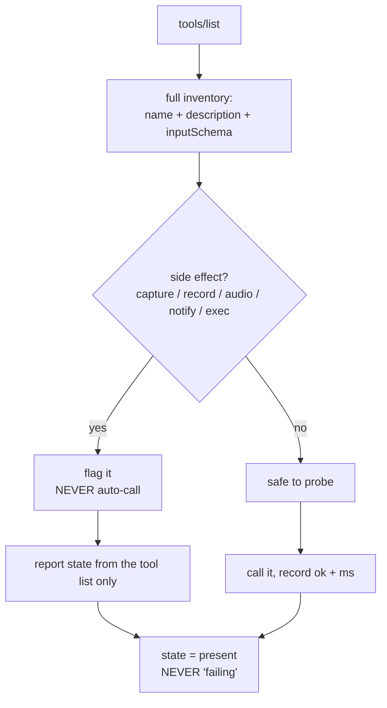

# Skill: mcp-tool-checklist

**Goal:** show the **complete** truth about an MCP server's tools, and never let a
status check turn into a side effect.

Package path: `skills/5_qa/mcp-tool-checklist/`

## The problem this solves

Two failures, both observed in production on 2026-09-20.

### 1. The checklist was not full

`tools/list` returns, for every tool: `name`, `description`, `inputSchema`
(complete JSON Schema), and `annotations`. The UI rendered **only the names** as
chips. So an operator could see that `screen.snapshot` exists, but not that
calling it captures the whole screen.

A tool list without descriptions and schemas is not a checklist. It is a list of
words.

### 2. A health probe caused a side effect

`screen.snapshot` was placed in `PROBE_TOOLS` as a "health check". It is not a
health check — it captures the entire screen (1920×1080, ~300–450 KB) and raises
a Windows notification: *"OpenClaw agent is capturing your screen."*

Because the report was polled (60s interval + on every page enter), a status
check became **repeated screen recording**:

| Metric | Value |
|---|---|
| `Screen captured` lines in the tray log | **597** |
| Worst burst | **7 captures in under 1 second** |

The user saw the capture notification and reasonably concluded their machine was
broken. It was the monitoring code.

## The rule

> **A health probe must be side-effect-free and cheap.**
> If a tool captures, records, plays audio, opens the microphone, notifies, or
> executes a command, it is **not** a probe.

## Method



### 1. Render the full inventory

For each tool, surface:

| Field | Why it matters |
|---|---|
| `name` | identity |
| `description` | what it actually does — the thing that reveals a side effect |
| `inputSchema.properties` | every parameter, its type, whether required, its default |
| `inputSchema.required` | which params you must supply |
| `annotations` | server-declared hints (read-only, destructive, idempotent) |
| **side-effect flag** | derived; the safety gate |

### 2. Derive the side-effect flag from data, not memory

Keep an explicit deny-list **and** a keyword scan, so a *new* capture/record tool
is caught automatically instead of silently becoming a "health check".

```python
FORBIDDEN_PROBE_TOOLS = {
    "screen.snapshot": "captures the full screen + raises a capture notification",
    "screen.record":   "records the screen",
    "camera.snap":     "takes a photo",
    "camera.clip":     "records video",
    "tts.speak":       "plays audio out loud",
    "stt.listen":      "opens the microphone",
    "system.notify":   "shows a desktop notification",
    "system.run":      "executes a shell command",
}

SIDE_EFFECT_KEYWORDS = (
    ("capture", "captures the screen"),
    ("snapshot", "takes a screen/image snapshot"),
    ("record", "records audio or video"),
    ("speak", "plays audio out loud"),
    ("listen", "opens the microphone"),
    ("notify", "shows a desktop notification"),
    ("exec", "executes a command"),
    ("run", "executes a command"),
    ("click", "moves the mouse / clicks"),
    ("type", "sends keystrokes"),
    ("send", "sends a message on the user's behalf"),
)
```

### 3. Enforce at the call site, not just in the list

A deny-list that is only consulted when building the list can be bypassed by
editing the list. Check it **inside the probe function**:

```python
def _probe(item):
    tool, args = item
    if tool in FORBIDDEN_PROBE_TOOLS:
        return {"tool": tool, "ok": False,
                "detail": "refused: %s is not a safe health probe (%s)"
                          % (tool, FORBIDDEN_PROBE_TOOLS[tool])}
    ...
```

### 4. An untested capability is `present`, never `failing`

If a capability cannot be safely tested, report it from the tool list as
`present`. Reporting `failing` for something you deliberately did not call is a
**false negative** — the mirror of the false-OK bug.

| State | Meaning |
|---|---|
| `working` | probed, and the call succeeded |
| `failing` | probed, and the call failed |
| `present` | in the tool list, deliberately not probed |
| `missing` | not in the tool list |

## Checklist before adding any tool to a probe list

- [ ] Does the tool's **name** contain capture / snapshot / record / speak /
      listen / notify / exec / run / click / type / send?
- [ ] Does its **description** say it captures, records, plays, or executes?
- [ ] Would calling it be visible to the user (notification, sound, screen flash)?
- [ ] Would calling it change state (write, delete, send)?
- [ ] If any answer is yes → **do not probe it.** Flag it and report `present`.

## Verification

Prove the probe is inert by counting the side effect, not by reading the code:

```python
before = log_text.count("Screen captured")
for _ in range(5):
    build_report()
after = log_text.count("Screen captured")
assert after - before == 0, "the probe still captures the screen"
```

Reading the code is not proof. Counting the side effect is.

## Anti-patterns

| Anti-pattern | Consequence |
|---|---|
| Probing a capture tool | Repeated screen recording; user thinks the machine is broken |
| Rendering tool names only | Operator cannot tell a safe tool from a dangerous one |
| Deny-list checked only when building the list | Bypassed by editing the list |
| Reporting `failing` for an untested capability | False negative; sends the operator chasing a non-problem |
| Trusting a cached tool list for health | Dead server reports `ok=True` with a stale tool count |
