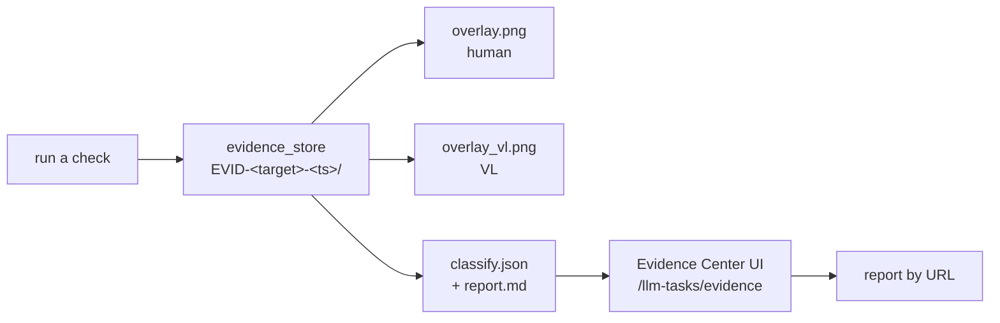

# Skill: QC by evidence

**Goal:** a worker reports QC with a **URL a human can open and judge** — not a
sentence claiming it worked.

Package path: `skills/5_qa/qc_evidence/`
Related skill: `skills/5_qa/evidence_classify/` (the classification method)
UI skill: `skills/3_ui/ui_field_builder.skill.md` (the UI conventions used)

## The loop



## Report format

Give the **URL**, not a summary:

```
http://127.0.0.1:18765/llm-tasks/evidence/EVID-perm_default-20260919-224139
```

Plus one machine line:

```
EVID-perm_default-20260919-224139  verdict=FAIL  edges_all_pass=false
  Q1(red box)=YES  Q2(label)=NO
  reason: text inside the red box reads "Local", not "Default permissions"
```

| Part | Why it is required |
|---|---|
| evidence id | the id IS the proof; a verdict without one is an assertion |
| URL | a reviewer opens it and sees the image |
| machine line | greppable, comparable across runs |
| reason | the model's own sentence — catches "right verdict, wrong cause" |

## URLs

| What | URL |
|---|---|
| Evidence list | `/llm-tasks/evidence` |
| One record | `/llm-tasks/evidence/<evidence_id>` |
| Overlay (human) | `/api/evidence/<id>/file/overlay.png` |
| Text-free (VL input) | `/api/evidence/<id>/file/overlay_vl.png` |
| Report | `/api/evidence/<id>/file/report.md` |
| Machine verdict | `/api/evidence/<id>/file/classify.json` |
| List as JSON | `/api/evidence/list?target=perm_default` |

## Rules

1. **Never report PASS without an evidence id.** The id is the proof.
2. **The URL must resolve.** If the Evidence Center cannot show it, the evidence
   does not exist as far as a reviewer is concerned. Test the link before sending.
3. **Two images, two audiences.** `overlay.png` (annotated) for a human;
   `overlay_vl.png` (text-free) is what the model read. Never merge them — the
   annotation text gets mistaken for the box contents.
4. **UNKNOWN is reportable.** "I could not verify" is honest. "Looks fine" is not.
5. **Append-only.** A re-run makes a new id. Never edit an existing folder — a
   passing run must not be able to overwrite a failing one.
6. **A failure is still evidence.** A screenshot failure is stored with
   `verdict=UNKNOWN`; a failed capture must leave a trace.
7. **A reason, not just a verdict.** Q1/Q2 reasons expose a wrong-cause verdict:
   FAIL for "box is mis-positioned" is a different action from FAIL for
   "text is wrong".

## Reading a verdict

| Q1 red box | Q2 label | Verdict | What it means |
|---|---|---|---|
| YES | YES | PASS | edges all PASS too — the only real pass |
| YES | NO | FAIL | the box is on the wrong thing, or the text is wrong |
| NO | — | UNKNOWN | the overlay did not draw, or the model cannot see it |
| either | no answer | UNKNOWN | the model did not answer yes/no — never a pass |

## UI rules (from ui_field_builder)

- Detail is **URL-addressable** so a verdict can be linked, not pasted.
- Read-only page → a Refresh button; nothing that can wipe user input.
- The empty state must give the exact command that creates evidence.
- Serve images through the API, never a filesystem path in the DOM.
- A **Copy URL** button, because the URL is the deliverable.

## Creating evidence

Evidence is produced by whatever ran the check. For the permission picker:

```
python f_perm_click.py --verify-area default
python f_perm_click.py --verify-area allow_all
python f_perm_click.py --verify-area autopilot
```

(The CLI accepts both `default` and `perm_default`.)

## Evidence folder

```
evidence/<evidence_id>/
    shot.png          raw capture
    overlay.png       annotated    -> the HUMAN inspects this
    overlay_vl.png    text-free    -> what the VL read
    crop.png          close-up
    classify.json     machine verdict
    report.md         human report
```

Root: `C:\projects\agent_system\evidence\`

## QC harness

`qc_evidence_classify.py` — three layers:

```
python qc_evidence_classify.py              # layers 1+2, fast, no model
python qc_evidence_classify.py --vl         # + local 7B VL cases
python qc_evidence_classify.py --real perm_default perm_allow_all perm_autopilot
```

Layer 3 needs a human: open the target UI, then inspect each overlay PNG and
confirm the red full-span lines cut the target boundary. Only then may any
calibration constant (`DEFAULT_AREAS`) be updated — and per rule 5, with
`checklist_confirm=no` until the runs actually pass.

## Verified 2026-09-19

| Check | Result |
|---|---|
| `/api/evidence/list` | `count=2`, both records, filter works |
| Evidence Center list | 2 rows, verdict badges, nav icon `title="Evidence Center"` |
| Detail URL | `/llm-tasks/evidence/EVID-perm_default-20260919-224139` resolves |
| Both images render | `overlay.png` + `overlay_vl.png`, `naturalWidth=1920` |
| Q1 / Q2 cards | `YES`, `NO` with the model's own reasons |
| Edge table | 4 rows: X1/X2/Y1/Y2 with candidate, detected, delta |
| File links | 6 files listed, all served through the API |
| `overlay_vl.png` stored | was missing before this change — now 6 files, 748 KB |